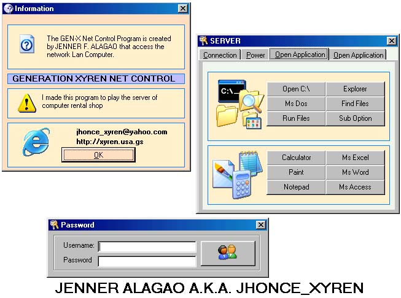



## Gen\-X Net Control

### Description

HACK THE LAN COMPUTER

BESTLINK NOVA TO!!!!

PAG NAG-RENT KA NG PC ,PWEDE MONG CONTROL -IN UNG SERVER

The GEN-X Net Control can be control network program full power access,

Accepting RESTART, SHUTDOWN , HIBERNATE ,LOG-OFF AND STANDBY

You can also open some Apllication Like MS WORD , MSPAINT , MSACCESS, FIND FILES explorer

and hide the desktop icons and taskbar

this can be a server for computer shop cafe
 
### More Info
 
YOU ONLY NEED TO INPUT THE IP ADDRESS OR COMPUTER NAME THAT YOU WANT TO ACCESS

IN LAN NETWORK CONNECTION

JUST FEEDBACK AT ME

JHONCE_XYREN@YAHOO.COM

OR MAY BE TAG AT MY SITE

HTTP://XYREN.USA.GS

100 % ACCESS THE FULL SYSTEM OF THE CLIENT COMPUTER

NONE!!!!

             |
---                |---
**Submitted On**   |2005-01-28 00:46:42
**By**             |[Jenner Alagao](https://github.com/Planet-Source-Code/PSCIndex/blob/master/ByAuthor/jenner-alagao.md)
**Level**          |Advanced
**User Rating**    |4.5 (18 globes from 4 users)
**Compatibility**  |VB 6\.0
**Category**       |[Microsoft Office Apps/VBA](https://github.com/Planet-Source-Code/PSCIndex/blob/master/ByCategory/microsoft-office-apps-vba__1-42.md)
**World**          |[Visual Basic](https://github.com/Planet-Source-Code/PSCIndex/blob/master/ByWorld/visual-basic.md)
**Archive File**   |[Gen\-X\_Net\_1844931282005\.zip](https://github.com/Planet-Source-Code/jenner-alagao-gen-x-net-control__1-58506/archive/master.zip)

